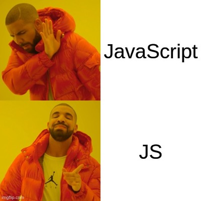

# Web Development 1- JS

A repository to store all the course content files for **'Web Development 1 JavaScript'**. It includes files like class notes, assignments, labs, etc. for the course.

---

## Instructor

- Sean Doyle

---

## What We Learn

In this class, we look at the core principles for JavaScript scripting language. We learn about its components and the ways it can be used to make our websites more engaging.[^1]



_A programming meme for MySQL"_

> :memo: **Note:** This class is very fun because of the fact that it requires a lot of thinking and also because of our tutor Sean.

[^note]: This class takes place in the LB 126 room every Wednesday from 11:40 AM - 2:20 PM.

---

## Learning Resource
[W3School](https://www.w3schools.com/Js/)

---

## Code Sample - JS

```javascript
const person = {fname:"John", lname:"Doe", age:25};

let text = "";
for (let x in person) {
  text += person[x];
}
```

- SQL scripts
- Operators
- Aggregate functions and Groups
- Joins and aliases
- Pks and FKs
- Database design practice

[^1]: We have learned the above topics by now:
